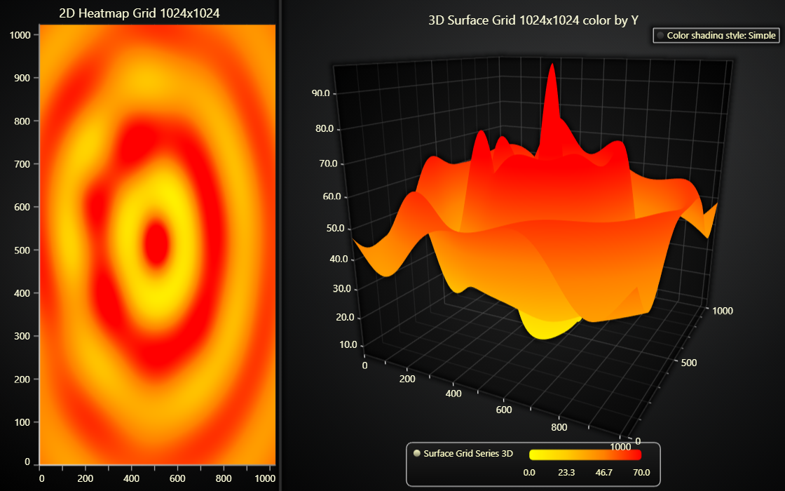

# JavaScript 3D Surface Grid Chart

This demo application belongs to the set of examples for LightningChart JS, data visualization library for JavaScript.

LightningChart JS is entirely GPU accelerated and performance optimized charting library for presenting massive amounts of data. It offers an easy way of creating sophisticated and interactive charts and adding them to your website or web application.

The demo can be used as an example or a seed project. Local execution requires the following steps:

-   Make sure that relevant version of [Node.js](https://nodejs.org/en/download/) is installed
-   Open the project folder in a terminal:

          npm install              # fetches dependencies
          npm start                # builds an application and starts the development server

-   The application is available at _http://localhost:8080_ in your browser, webpack-dev-server provides hot reload functionality.

## Description

This example showcases the `SurfaceGridSeries` feature of LightningChart JS.

Surface Grid Series is used to visualize a data set in form of a grid. To interpret the data, imagine a grid that is layed on the plane between X and Z axes.

Similarly to Heatmap Grid Series, Surface Grids are split into a number of **columns** (X axis) and **rows** (Z axis). For each intersection between a column and row, there is a **data point** in the surface grid series.

In this example, the surface grid has 1024 columns and 1024 rows, summing up to a total of 1 048 576 data points. Each of this data points is associated with a **height** (Y axis) value. Additionally, the surface is colored dynamically based on each data points Y value.

To highlight the similarity, a 2D Heatmap Grid Series with the same data set and palette is displayed on the left side.

Finally, this example also showcases the available selection of _3D color shading style_ (simple or _Phong_). By default, surface series use simple color shading, which displays all colors as they are. To improve depth perception, _phong_ shading can be enabled to simulate the behavior of light in the scene.

# About Performance

`SurfaceGridSeries` is one of the latest additions to LightningChart JS, and as such it enjoys from the very latest optimizations. Surface Grid Series is very well optimized for memory consumption and CPU usage, usual maximum data set sizes with good PC's are in range of billions of data points.

This is ground breaking performance, as traditionally surface charts are really expensive components with the size limit being around 10 000 data points (100 000x smaller).

Large Surface Grid Series are very GPU intensive which shows as slow redrawing. When developing applications that utilize them, it is best to avoid unnecessary redraws to maintain good refresh rate with weak devices, such as laptops and phones.

# More Surface Examples

-   [Chunked Surface Grid Chart](https://lightningchart.com/lightningchart-js-interactive-examples/examples/lcjs-example-0916-surfaceChunkLoad.html) | This example shows how surface grid series can be split into sub sections which are loaded individually for better performance and response time.

-   [Intensity Surface Grid Chart](https://lightningchart.com/lightningchart-js-interactive-examples/examples/lcjs-example-0914-surfaceIntensityGrid.html) | This example showcases how surface grid series can be colored based on a different data set than the height map used in this example.

-   [Real-Time Audio Spectrum Surface Chart](https://lightningchart.com/lightningchart-js-interactive-examples/examples/lcjs-example-0913-surfaceScrollingGrid.html) | This example showcases using real-time data source with surface series.

-   [All Surface Examples](https://lightningchart.com/lightningchart-js-interactive-examples/search.html?t=surface)

## API Links

* [3D chart]
* [3D axis]
* [Paletted Fill]
* [Color lookup table]
* [Color RGBA factory]
* [Color shading styles (3D)]
* [Surface Grid Series]
* [Heatmap Grid Series]
* [Legend Box]

## Support

If you notice an error in the example code, please open an issue on [GitHub][0] repository of the entire example.

Official [API documentation][1] can be found on [LightningChart][2] website.

If the docs and other materials do not solve your problem as well as implementation help is needed, ask on [StackOverflow][3] (tagged lightningchart).

If you think you found a bug in the LightningChart JavaScript library, please contact sales@lightningchart.com.

Direct developer email support can be purchased through a [Support Plan][4] or by contacting sales@lightningchart.com.

[0]: https://github.com/Arction/
[1]: https://lightningchart.com/lightningchart-js-api-documentation/
[2]: https://lightningchart.com
[3]: https://stackoverflow.com/questions/tagged/lightningchart
[4]: https://lightningchart.com/support-services/

© LightningChart Ltd 2009-2022. All rights reserved.

[3D chart]: https://lightningchart.com/js-charts/api-documentation/v7.1.0/classes/Chart3D.html
[3D axis]: https://lightningchart.com/js-charts/api-documentation/v7.1.0/classes/Axis3D.html
[Paletted Fill]: https://lightningchart.com/js-charts/api-documentation/v7.1.0/classes/PalettedFill.html
[Color lookup table]: https://lightningchart.com/js-charts/api-documentation/v7.1.0/classes/LUT.html
[Color RGBA factory]: https://lightningchart.com/js-charts/api-documentation/v7.1.0/functions/ColorRGBA.html
[Color shading styles (3D)]: https://lightningchart.com/js-charts/api-documentation/v7.1.0/variables/ColorShadingStyles.html
[Surface Grid Series]: https://lightningchart.com/js-charts/api-documentation/v7.1.0/classes/SurfaceGridSeries3D.html
[Heatmap Grid Series]: https://lightningchart.com/js-charts/api-documentation/v7.1.0/classes/HeatmapGridSeriesIntensityValues.html
[Legend Box]: https://lightningchart.com/js-charts/api-documentation/v7.1.0/classes/Chart.html#addLegendBox

